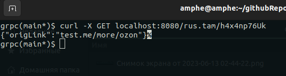

# Информация о решении:

Тестовое задание Ozon-fintech. GRPC-реализация. 
Сервис запускается с помощью Makefile и docker-compose.
Способ хранения определяется Makefile, либо вручную. Выбор - PostgreSQL/Redis

 [Старт.](#старт)
 [Алгоритм шифрования и почему он работает.](#алгоритм-шифрования-и-почему-он-работает)
 [Проверка решения.](#проверка-решения)

## Старт:
    make app-on-redis # старт с Redis в качестве хранилища.
    make app-on-postgres # старт с PostgreSQL в качестве хранилища.
    docker-compose run app -storage=PostgreSQL/Redis # старт командой run.

## Алгоритм шифрования и почему он работает.
 <b>Основная идея разработанного алгоритма заключается именно в том, чтобы получать только один и единственный 
 шифр для каждой оригинальной ссылки и при этом было доступным для понимания. 
 Из-за этого мой выбор пал не на хеш от времени или фантомных переменных, а на 
 sha256 и модифированный алгоритм EncodeBase62/64 для мощности алфавита 63, расписанного в тз. 
  WorkFlow: usecase -link-> HashLink(link string) -n-> EncodeBase63(n uint64) <-> back | 
  Алгоритм получает на вход строку link, хеширует ее с помощью sha256 и парсит хеш в *big.Int, откуда далее
преобразуется в uint64 и попадает в EncodeBase63 где и сокращает строку. </b>

## Проверка решения:

  Все эндпоинты находятся на `localhost:8080`
    Эндпоинты данной реализации:
    `/create` с передачей JSON.
    `/{abbreviatedLink}` с передачей сокращенной ссылки формата `rus.tam/HgJ46nyw8E`

### <i> С помощью CLI </i>: 

 `- Запрос POST командой curl`

 `- Запрос GET командой`

### <i> C помощью Postman/Insomnia/etc.. </i>:

 `- Запрос POST c Postman`

 `- Запрос GET c Postman`
